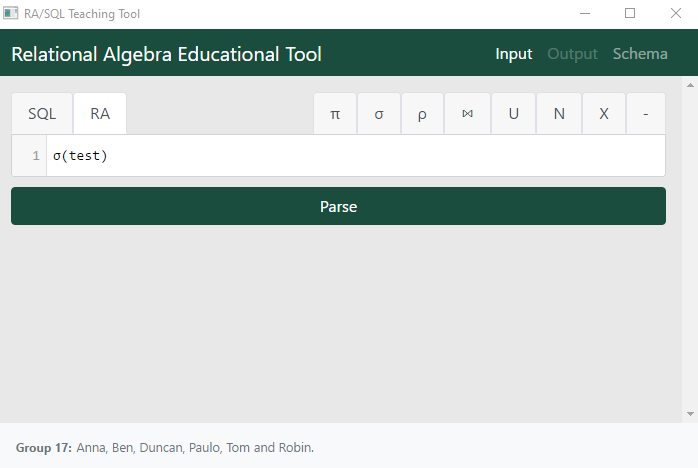
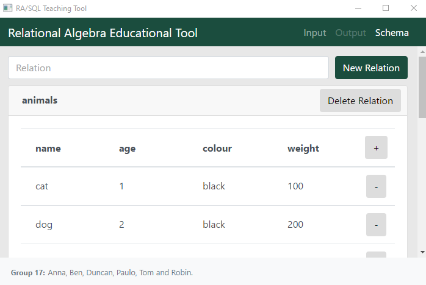

# Relational Algebra Education Tool (Rasql)
## COMP208 - Group 17

An educational tool to visualise and optimise relational algebra and SQL
queries. Built with the neutronium framework.

Special thank you to [Ben!](https://github.com/TGNThump) for the swift implementation work. 

### Preview

